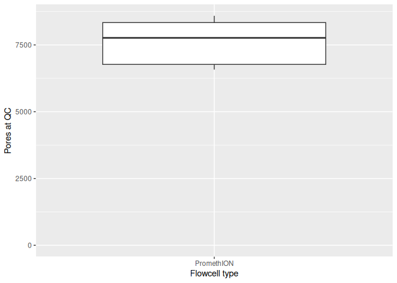
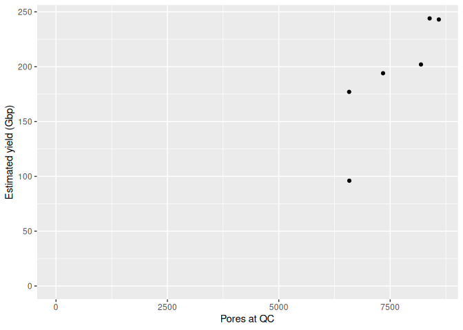
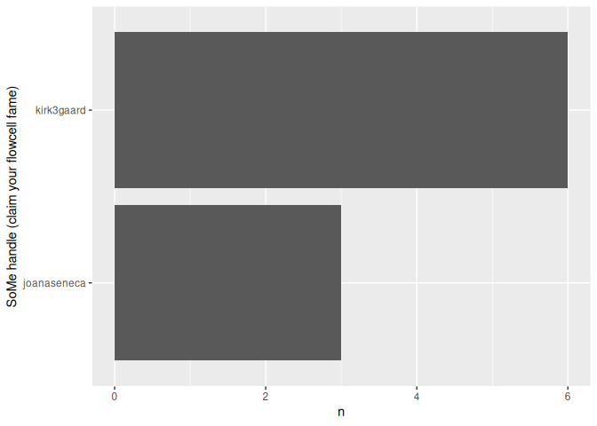

README
================
Rasmus Kirkegaard
05 November, 2025

# ONT-yield-tracker

Community sourced tracking of nanopore yields. Are flowcells getting
better?

Recently had several Nanopore PromethION flowcells going beyond 200 Gbp
and wondered whether this is a common trend.

- Report your flowcell yields here: [Google
  form](https://forms.gle/nmUqXLYKG3DxP3SLA)
- See the reported values in this [Google
  sheet](https://docs.google.com/spreadsheets/d/1nnnyTM5DiRpobnvqFs0ag48_qqbuEmebVqI_UV5evr8/)

## Pores available at QC

<!-- -->

## Data volumes vs pores at QC

<!-- -->

## Most reported flowcells

<!-- -->
